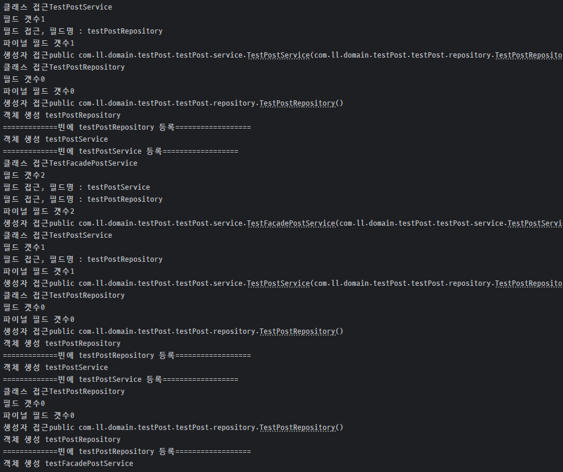
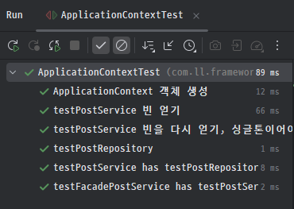

## 📚 사전 지식 습득

`@Target(ElementType.TYPE)`, `@Retention(RetentionPolicy.RUNTIME)`의 의미

@Target은 개발자에게 해당 애노테이션이 어디에 적용될 수 있는지 알려주는 역할을 한다.  
`ElementType.TYPE` :  클래스, 인터페이스, 열거형, 어노테이션에 붙을 수 있다.  
`FIELD`, `METHOD`, `PARAMTER`, `CONSTRUCTOR` 등등이 있다.

<br><br>
`@Retention`은 커스텀 애노테이션의 정보가 언제까지 유지될지를 지정한다.

`RetentionPolicy.SOURCE` : 컴파일시점에만 존재하고 `.class`생성시 포함되지 않는다.  
`.CLASS` : `.class`생성시 까지포함되지만 런타임에 포함되지 않는다.  
`RUNTIME` : 런타임에도 유지된다.


## 자바 리플렉션과 Reflections 라이브러리

### 자바 리플렉션 (Java Reflection)

자바 리플렉션은 **JVM에 이미 로드된 클래스의 정보를 분석하고 조작하는 자바의 내장 기능**이다.
`java.lang.reflect` 패키지에 포함되어 있으며, 클래스, 필드, 메서드 등의 정보를 동적으로 조회하고 조작하는 데 사용된다.

- **특징**: 이미 로드된 클래스에 대한 정보만 다룰 수 있다. 즉, 런타임에만 사용 가능하다.
- **용도**: 프레임워크나 IDE에서 내부 구조를 분석할 때 주로 사용됩니다.

---

### Reflections 라이브러리

`Reflections`는 **클래스패스(Classpath)를 스캔하여 아직 JVM에 로드되지 않은 클래스들을 탐색하는 기능을 제공하는 외부 라이브러리**이다.

- **특징**: 특정 패키지 아래의 모든 클래스, 특정 어노테이션이 붙은 클래스, 특정 인터페이스를 구현한 클래스 등을 찾을 수 있다.
- **용도**: 프레임워크나 DI 컨테이너(스프링의 컴포넌트 스캔 등)에서 필요한 클래스들을 자동으로 찾아 등록할 때 사용된다.

---

### 결론

자바 리플렉션은 **하나의 클래스 내부를 들여다보는 도구**이고,
`Reflections` 라이브러리는 **여러 클래스들이 모여있는 클래스패스 전체를 검색하는 도구**다.

`클래스패스` : JVM이 프로그램을 실행할 때 클래스 파일(*.class)이나 리소스 파일들을 찾는 데 사용하는 경로들의 집합

## 트러블슈팅

`Constructor.instance.getClass().getName()`에서 이름이 길게 나오는 문제
- `com.ll.domain.testPost.testPost.repository.TestPostRepository`으로 출력되었음
- `getName()`대신 `getSimpleName()`사용하고 Ut.str.lcfirst() 활용


`String annotationName = annotation.getClass().getTypeName();`에서 $Proxy로 이름이 나오는문제
- `String annotationName = annotation.annotationType().getSimpleName();`로 해결

`@RequiredArgsConstructor`가 붙은 애노테이션을 따로 처리하려고 했던 문제
- `@RequiredArgsConstructor` 의 RetentionPolicy는 `SOURCE`이다. 즉 Reflection으로 잡을 수가 없다!
- 이미 final이 붙은 필드를 주입하는 생성자가 컴파일 시점에 생성된 것을 인지하고 코드를 작성해야 한다.

```java
private void putInstanceInBeans(Set<Class<?>> scannedClass) {
    for (Class<?> clazz : scannedClass) {
        System.out.println("클래스 접근" + clazz.getSimpleName());
        try {
            Annotation[] annotations = clazz.getAnnotations();
            System.out.println("어노테이션 접근" + clazz.getSimpleName());
            if (annotations.length > 0) {
                for (Annotation annotation : annotations) {
                    String annotationName = annotation.annotationType().getSimpleName();
                    System.out.println("어노테이션 이름" + annotationName);
                    if (annotationName.equals("RequiredArgsConstructor")) {
                        Field[] fields = clazz.getDeclaredFields();
                        List<Class<?>> finalFields = new ArrayList<>();
                        for (Field field : fields) {
                            int modifiers = field.getModifiers();
                            if (Modifier.isFinal(modifiers)) {
                                finalFields.add(field.getType());
                            }
                        }
                        System.out.println("RequiredArgsConstructor 검색완료");
                        Constructor<?> requiredArgsConstructor = clazz.getDeclaredConstructor(
                                finalFields.toArray(Class[]::new));
                        System.out.println("RequiredArgsConstructor 생성자 생성완료");

                        Object instance = requiredArgsConstructor.newInstance(finalFields.toArray());
                        String simpleName = instance.getClass().getSimpleName();
                        String beanName = str.lcfirst(simpleName);
                        beans.put(beanName, instance);
                    } else {
                        Constructor<?> basicConstructor = clazz.getDeclaredConstructor();
                        Object instance = basicConstructor.newInstance();
                        String simpleName = instance.getClass().getSimpleName();
                        String beanName = str.lcfirst(simpleName);
                        beans.put(beanName, instance);
                    }
                }
            }
        } catch (NoSuchMethodException | InstantiationException | InvocationTargetException |
                 IllegalAccessException e) {
            System.out.println("예외 발생" + e.getMessage());
        }
    }
}

```

```java
//실행결과 로그 @RequiredArgsConstructor를 잡아내지 못한다.
13:57:50.204 [main] INFO org.reflections.Reflections -- Reflections took 60 ms to scan 2 urls, producing 6 keys and 18 values
클래스 접근TestPostService
어노테이션 접근TestPostService
어노테이션 이름Service
예외 발생com.ll.domain.testPost.testPost.service.TestPostService.<init>()
클래스 접근TestFacadePostService
어노테이션 접근TestFacadePostService
어노테이션 이름Service
예외 발생com.ll.domain.testPost.testPost.service.TestFacadePostService.<init>()
클래스 접근TestPostRepository
어노테이션 접근TestPostRepository
어노테이션 이름Repository
```


## 1차 구현 코드

<details>
  <summary>상세 코드</summary>

```java
public class ApplicationContext {

    Map<String, Object> beans;

    public ApplicationContext(String basePackage) {
        beans = new HashMap<>();
        Set<Class<?>> scannedClass = scanWithComponentAnnotation(basePackage);
        putInstanceInBeans(scannedClass);
        System.out.println(beans);
    }

    //TODO : 순환참조 문제 고려
    private void putInstanceInBeans(Set<Class<?>> scannedClass) {
        for (Class<?> clazz : scannedClass) {
            System.out.println("클래스 접근" + clazz.getSimpleName());
            try {
                Field[] declaredFields = clazz.getDeclaredFields();
                System.out.println("필드 갯수" + declaredFields.length);
                List<Field> finalFields = new ArrayList<>();
                for (Field field : declaredFields) {
                    System.out.println("필드 접근, 필드명 : " + field.getName());
                    //TODO : finalField가 4개지만 생성자 매개변수가 3개인 경우는 실패할 것
                    if (Modifier.isFinal(field.getModifiers())) {
                        finalFields.add(field);
                    }
                }
                Class<?>[] finalFieldTypes = finalFields.stream().map(Field::getType).toArray(Class<?>[]::new);
                System.out.println("파이널 필드 갯수" + finalFieldTypes.length);
                Constructor<?> constructor = clazz.getDeclaredConstructor(finalFieldTypes);
                System.out.println("생성자 접근" + constructor);

                //의존성이 없다면 기본생성자로 생성 후 bean에 등록
                if (finalFieldTypes.length == 0) {
                    String simpleName = constructor.getDeclaringClass().getSimpleName();
                    String beanName = str.lcfirst(simpleName);
                    Object instance = constructor.newInstance();
                    System.out.println("객체 생성 " + beanName);
                    beans.putIfAbsent(beanName, instance);
                    System.out.println("=============빈에 " + beanName + " 등록==================");
                } else {
                    //재귀호출
                    putInstanceInBeans(new HashSet<>(List.of(finalFieldTypes)));
                    String simpleName = constructor.getDeclaringClass().getSimpleName();
                    String beanName = str.lcfirst(simpleName);
                    Object instance = constructor.newInstance(Arrays.stream(finalFieldTypes).map(key -> beans.get(Ut.str.lcfirst(key.getSimpleName()))).toArray(Object[]::new));
                    System.out.println("객체 생성 " + beanName);
                    beans.putIfAbsent(beanName, instance);
                    System.out.println("=============빈에 " + beanName + " 등록==================");
                }
            } catch (NoSuchMethodException | InstantiationException | InvocationTargetException |
                     IllegalAccessException e) {
                System.out.println("예외 발생" + e.getMessage());
            }
        }
    }

    private Set<Class<?>> scanWithComponentAnnotation(String basePackage) {
        Reflections reflections = new Reflections(basePackage);
        Set<Class<?>> scannedClass = reflections.getTypesAnnotatedWith(Component.class);
        scannedClass.removeIf(Class::isAnnotation);
        return scannedClass;
    }

    public void init() {
    }

    public <T> T genBean(String beanName) {
        return beans.containsKey(beanName) ? (T) beans.get(beanName) : null;
    }
}
```
</details>

 



테스트 6개를 전부 통과했지만 다음과 같은 문제가 존재한다.

1️⃣ 순환 참조 문제

A클래스가 B를 컴포지션하고 컨테이너에 의해 주입받는다고 하자.

그런데 B클래스도 A클래스를 컴포지션 하고 주입받는다면 현재 코드에서는 무한 재귀한다.

2️⃣ 생성자에 로직이 있거나 final 필드 갯수와 생성자 파라미터의 갯수가 불일치 하는 시나리오

현재 로직은 파이널 필드의 갯수와 생성자의 파라미터 갯수가 일치 하는 경우에만 성공할 수 있다.

현재 로직은 클래스에서 선언된 final 필드 들을 constructor에 넣는 방식이라 문제가 발생한다.

Constructor.getParameterTypes()라는 메소드가 있는 것을 확인 할 수 있었고, 이 메소드를 이용하면 해결할 수 있다.

3️⃣ 빈을 중복 생성 하는 문제

심각성이 큰 문제가 아니기도 하고, 빈 생성 전에 등록되있는지 확인하면 쉽게 고칠 수 있는 있다.

✨ 리팩토링을 하려고 했었는데 컨테이너 구현에 대한 로직도 충분히 익혔으니 V3에서 코드를 다시 작성하는 것으로 결론지었다.